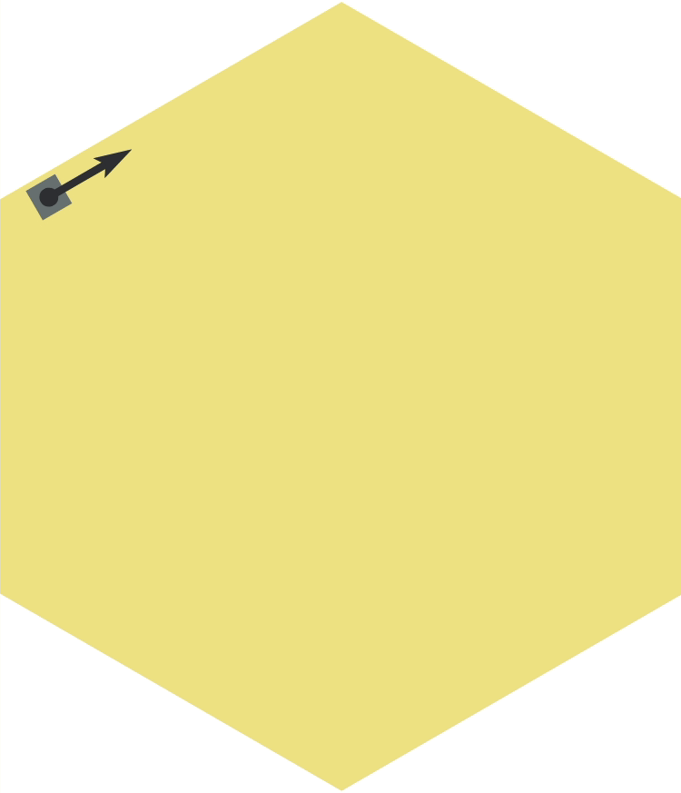

# rTRhexNG: R-generated hexagon sticker for rTRNG

<!-- badges: start -->
[](https://travis-ci.org/miraisolutions/rTRhexNG)
<!-- badges: end -->



**rTRhexNG** is an R package featuring a Shiny app to create a hexagon logo for
[**rTRNG**](https://github.com/miraisolutions/rTRNG#readme).

The core design idea behind the logo is to illustrate the key features of
**rTRNG**: jump and split operations on (pseudo-)random sequences. R is used to
automate the creation and location of several visual elements representing
random sequences, and the Shiny app built on top allows to quickly assess
alternative designs in an interactive way.

The Shiny app is also very useful to interactively illustrate what jump and
split mean in **rTRNG**, with the logo emerging from their visual representation
in a natural way. The implementation actually supports alternative polygon or
circle designs, which can be also explored in the app.

You can access the Shiny app at https://miraisolutions.shinyapps.io/rTRhexNG.

The **rTRhexNG** package can be installed via
``` r
devtools::install_github("miraisolutions/rTRhexNG")
```
and the app is available as
``` r
rTRhexNG::rTRhexNG_app()
```

Note that the logo relies on specific fonts, which are shipped with the package
and can be installed (on Linux systems) via
``` r
rTRhexNG::install_fonts()
```
or manually given their path obtained using
``` r
rTRhexNG::fonts_path()
```


